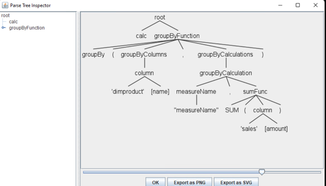

# RussianBI

В примере предлагается реализовать логику обхода дерева  с целью генерации простого SQL запроса для абстрактного языка запросов. 

Запрос 

```
calc groupBy('dimproduct'[name], \"measureName\", SUM('sales'[amount]))
```
Дерево (результат выполнения парсера):

Необходимо реализовать метод SqlBuilder.Build с целью генерации запроса вида 

```sql
select dimproduct.name, 
       sum(sales.amount) as 'measureName'
from sales fact
left join 
dimproduct dim
on fact.productkey = dim.key
group by dimproduct.name
```
